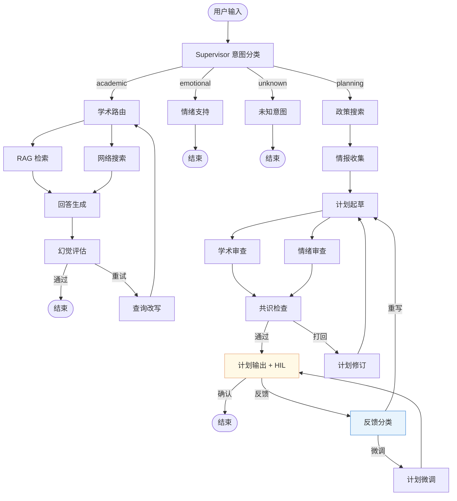

# GraphTutor — 基于 LangGraph 的多智能体 RAG 辅导系统

<p align="center">
  
  
  
  
  
</p>

<p align="center">
  <a href="##快速启动"><strong>快速开始</strong></a> ·
  <a href="##系统架构"><strong>系统架构</strong></a> ·
  <a href="##技术亮点"><strong>技术亮点</strong></a> ·
  <a href="##项目结构"><strong>项目结构</strong></a>
</p>

---

## 关于本项目

**GraphTutor** 是一个面向生产环境的**多智能体对话 AI 系统**，以高考备考辅导为业务场景，深度集成了 **LangGraph 图编排**、**混合 RAG 检索**、**对抗性生成质量保证** 和 **人在回路 (Human-in-the-Loop)** 等前沿 AI 工程实践。

系统围绕 LangGraph StateGraph 构建 **19 个节点的有状态多智能体工作流**：轻量级 Qwen2.5-7B Supervisor 进行意图路由，将用户请求分发至学科辅导（并行 RAG + Web 检索）、学习规划（对抗性起草审查循环）、情绪支持三个专业 Agent 分支，并通过 SSE 协议将推理过程实时推送至 React Flow 交互式 DAG 可视化界面。

> **项目定位**：深度实践 LangGraph 底层框架的 Multi-Agent 编排能力，探索 AI 应用的生产级工程化方案。

---

## 技术亮点

### 🧠 多智能体编排（LangGraph StateGraph）

- 构建包含 **19 个节点**的复杂有状态图，涵盖 Supervisor 意图路由、并行 Fan-out/Fan-in 检索、条件重试循环、对抗性审查共识、人在回路中断恢复等高级工作流
- Supervisor 基于 Qwen2.5-7B + Structured Output 实现低延迟确定性意图分类（academic / planning / emotional / unknown）
- 自定义 `context_reducer` 实现并行分支的状态安全合并，避免 Fan-in 时的数据覆盖

### 🔍 混合 RAG 检索管道

```
用户查询 → 向量检索 (ChromaDB + BGE-M3) → BM25 关键词检索 (jieba 分词)
         → MD5 去重合并 → BGE-Reranker 重排序 → 相关性阈值过滤
```

- **双路召回**：语义向量 + 中文关键词互补，解决专业术语的精确匹配问题
- **SectionAwareSplitter**：针对中文试卷标题结构（一、二、三…）的自定义分块策略
- **懒加载 + 自动失效**：BM25 单例模式，ChromaDB 文档数变化时自动重建
- **API 降级**：onnxruntime 不可用时自动切换纯 NumPy 向量存储

### 🛡️ 对抗性规划质量保证

```
Drafter（计划起草） → Reviewer Academic ∥ Reviewer Emotional（并行双审）
                    → Consensus Check（共识检查）
                    → 通过 → 输出 ｜ 不通过 → 重写（最多 N 轮）
```

- 两个独立审查员从学术质量 / 情绪健康两个维度交叉评估
- 安全阀机制：达到最大轮次后强制输出，防止死循环
- 反馈路由器自动分类用户意见为"微调"或"重写"，匹配不同处理策略

### 👤 人在回路 (Human-in-the-Loop)

- LangGraph 原生 `interrupt()` 实现图表执行暂停，等待人工审批
- 前端提供可编辑的计划审阅组件，支持直接修改、自然语言反馈、一键导出 Markdown
- `/resume` 端点通过 `Command(resume=...)` 恢复中断的图表状态
- 多轮反馈摘要压缩，防止上下文膨胀

### 🔧 生产级工程基础设施

- **LLM 容灾降级**：DeepSeek 主模型超时/5xx 自动切换 SiliconFlow Qwen2.5-7B，OTel 记录容灾事件
- **分布式链路追踪**：OpenTelemetry 全埋点，OTLP gRPC 导出到 Jaeger + SQLite 本地兜底
- **服务可观测性**：请求级 `X-Request-ID`、结构化 JSON 日志、`/healthz` 存活探针、`/readyz` 就绪探针、`/metrics` 进程级指标快照
- **状态持久化**：PostgreSQL LangGraph Checkpointer，支持多轮对话记忆和 HIL 中断恢复；无数据库时自动降级无状态运行
- **SSE 流式传输**：9 种事件类型（node_event / token / usage / text / interrupt / done / error / thread_id），节点级 Token 用量统计
- **配置驱动**：YAML 管理运行参数（温度、超时、重试上限），XML 注册表管理 16 套提示词模板
- **前端可视化**：React Flow 交互式 DAG 实时显示 Agent 推理路径，节点状态颜色编码，重试边动画

---

## 系统架构



横切关注点：所有节点 `@traced_node` → OpenTelemetry → Jaeger / SQLite

详细架构图见 [`docs/architecture/v0.3.0/diagram_design.md`](docs/architecture/v0.3.0/diagram_design.md)

---

## 技术栈

| 层级 | 组件 | 说明 |
| ---- | ---- | ---- |
| **Agent 编排** | LangGraph 1.2+ | StateGraph + interrupt() HIL + 条件边 + Fan-out/Fan-in |
| **LLM 框架** | LangChain 1.3+ | ChatOpenAI 统一接口，Structured Output，流式输出 |
| **后端 API** | FastAPI + Uvicorn | SSE 端点（`/stream`、`/resume`）、异步生命周期管理 |
| **前端** | Next.js 16 + Tailwind CSS 4 + React Flow | SSE 消费端、交互式 DAG、Markdown/GFL 渲染 |
| **路由模型** | Qwen2.5-7B（SiliconFlow） | 意图分类 + 反馈路由（temperature=0.0，Structured Output） |
| **生成模型** | DeepSeek-V4-Flash | 学科解答、学习计划、情绪支持 |
| **容灾模型** | Qwen2.5-7B（SiliconFlow） | 跨厂商故障自动转移 |
| **向量检索** | ChromaDB + BGE-M3（SiliconFlow） | L2 距离 → 相关度归一化 |
| **关键词检索** | rank-bm25 + jieba | 中文分词 BM25 检索 |
| **重排序** | BGE-Reranker-v2-m3（SiliconFlow） | 双路召回合并后精排 |
| **网络搜索** | DuckDuckGo | 实时政策与在线知识补充 |
| **状态持久化** | PostgreSQL + langgraph-checkpoint-postgres | 多轮记忆 + HIL 中断恢复 |
| **可观测性** | OpenTelemetry + Jaeger + SQLite | 全链路分布式追踪 |
| **配置管理** | YAML + XML | 运行参数与提示词模板分离 |

---

## 效果演示

#### 多智能体对话 + 推理可视化


#### 对抗性规划 + HIL 人工审批


#### React Flow 交互式 DAG 视图


---

## 快速启动

### 环境要求

- Python 3.11+
- Node.js 18+ 和 npm
- uv（Python 依赖同步与锁文件管理）
- DeepSeek API Key + SiliconFlow API Key
- PostgreSQL（可选，不配置时自动降级为无状态模式）

仓库提供 `.python-version` 和 `.nvmrc`，使用 `uv` / `nvm` 时会自动选择推荐的 Python 3.11 和 Node.js 20。

### 1. 克隆项目

```bash
git clone https://github.com/chipfighter/gaokao_tutor.git
cd gaokao_tutor
```

### 2. 后端

```bash
# 安装 uv（如果尚未安装）
python -m pip install uv

# 按 uv.lock 同步隔离环境，避免使用系统 Python/Anaconda 里的包
python -m uv sync --extra dev --locked

# 配置 API Key
cp .env.example .env
# 编辑 .env，填入 DEEPSEEK_API_KEY 和 SILICONFLOW_API_KEY

# 私有访问登录。默认账号 admin、密码 123456。
# 暴露到公网前必须修改 AUTH_PASSWORD，并生成一个长随机 AUTH_SECRET。
# AUTH_USERNAME=admin
# AUTH_PASSWORD=123456
# AUTH_SECRET=replace_with_a_long_random_string
# AUTH_SESSION_HOURS=12
# HTTPS 部署时设置 AUTH_COOKIE_SECURE=true

# 可选：官方政策 / 招生数据 MCP。优先使用 MCP，失败时自动回退到通用 Web search。
# 二选一配置即可：
# POLICY_MCP_URL=http://127.0.0.1:8765/mcp
# POLICY_MCP_COMMAND="python path/to/policy_mcp_server.py"
# POLICY_MCP_TOOL=policy_search
# POLICY_MCP_TIMEOUT_SECONDS=10

# 可选：试卷/讲义解析 MCP。未配置时 PDF/DOCX 回退本地文本提取，
# 图片回退现有视觉 OCR；扫描版 PDF 建议配置支持 OCR 的 MCP。
# DOCUMENT_MCP_URL=http://127.0.0.1:8766/mcp
# DOCUMENT_MCP_COMMAND="python path/to/document_mcp_server.py"
# PDF_PARSE_MCP_TOOL=pdf_parse
# DOCX_PARSE_MCP_TOOL=docx_parse
# IMAGE_OCR_MCP_TOOL=image_ocr_plus
# QUESTION_SEGMENTER_MCP_TOOL=question_segmenter

# 构建知识库索引
python -m uv run python scripts/build_index.py

# 启动后端
python -m uv run python -m uvicorn app:app --host 127.0.0.1 --port 8002
```

`POST /documents/parse` 接收一个 PDF/DOCX 或多张图片，依次调用对应解析工具和
`question_segmenter`，统一返回题目级结构：

```json
{
  "questions": [
    {
      "number": "17",
      "subject": "math",
      "stem": "...",
      "options": [],
      "figures": [],
      "detected_knowledge_points": ["导数", "函数零点"],
      "source_pages": [3]
    }
  ],
  "parser": "mcp:pdf_parse",
  "segmenter_used": false
}
```

### 3. 前端

```bash
cd frontend
npm install
# 前端统一使用 npm：仅保留 frontend/package-lock.json，避免提交 frontend/pnpm-lock.yaml


# 创建前端环境配置
echo "NEXT_PUBLIC_API_URL=http://localhost:8002" > .env

# 启动开发服务器
npm run dev
```

访问 `http://localhost:3000` 查看完整界面。

### 4. Docker Compose（生产部署）

```bash
docker compose up -d
# 可选：启用 Jaeger 追踪
docker compose --profile observability up -d
```

### 5. 上线配置

上线前至少确认这些环境变量：

```bash
# 私有登录
AUTH_USERNAME=admin
AUTH_PASSWORD=replace_with_a_strong_password
AUTH_SECRET=replace_with_a_long_random_string
AUTH_COOKIE_SECURE=true

# 用户级每日限额
QUOTA_ENABLED=true
QUOTA_DAILY_REQUESTS=200
QUOTA_DAILY_TOKENS=300000
QUOTA_DAILY_UPLOADS=50
QUOTA_DAILY_RETRIES=30

# 上传安全
DOCUMENT_PARSE_MAX_FILE_MB=25
DOCUMENT_PARSE_MAX_FILES=12
OCR_MAX_IMAGE_MB=8
UPLOAD_TASK_TIMEOUT_SECONDS=180
UPLOAD_MAX_UNCOMPRESSED_MB=100
UPLOAD_MAX_COMPRESSION_RATIO=100
UPLOAD_AV_COMMAND=
UPLOAD_AV_TIMEOUT_SECONDS=30
```

`UPLOAD_AV_COMMAND` 留空时只启用本地静态检查：扩展名/MIME/文件签名一致性、PDF 活动内容拦截、DOCX 宏与压缩包异常检查。生产环境建议接入杀毒命令，例如 `clamscan --no-summary`。

每日 quota 按认证用户记录在 `data/quota/daily.json`，上传审计记录在 `data/audit/uploads.jsonl`。这两个目录是运行时数据，默认不提交到 Git。当前实现适合单机部署；多实例部署应迁移到 Redis 或 PostgreSQL。

---

## SSE 事件协议

| 事件类型 | 描述 | 示例载荷 |
| -------- | ---- | -------- |
| `thread_id` | 会话标识（流开始） | `{"type":"thread_id","thread_id":"abc..."}` |
| `node_event` | 节点生命周期 | `{"type":"node_event","node":"drafter","status":"start","duration_ms":1234}` |
| `token` | 流式 Token（逐字推送） | `{"type":"token","content":"你"}` |
| `text` | 非流式节点完整输出 | `{"type":"text","content":"...","node":"plan_output"}` |
| `usage` | Token 用量统计 | `{"type":"usage","node":"drafter","input_tokens":500,"output_tokens":200}` |
| `interrupt` | HIL 中断暂停 | `{"type":"interrupt","draft":"...","thread_id":"..."}` |
| `done` | 流完成标记 | `{"type":"done"}` |
| `error` | 错误信息 | `{"type":"error","message":"..."}` |

---

## 项目结构

```text
gaokao_tutor/
├── app.py                        # FastAPI SSE 端点 + 生命周期管理
├── Dockerfile                    # 多阶段构建（前端 + 后端）
├── docker-compose.yml            # 一键部署（后端 + PostgreSQL + Jaeger）
├── config/
│   ├── settings.yaml             # 运行参数（温度、超时、重试上限）
│   └── prompts/                  # 16 套 XML 提示词模板
├── src/
│   ├── graph/
│   │   ├── builder.py            # StateGraph 构建与编译（19 个节点）
│   │   ├── state.py              # TutorState TypedDict（26 个字段 + context_reducer）
│   │   ├── supervisor.py         # 意图路由 + 关键词提取（Structured Output）
│   │   ├── academic.py           # 并行 RAG+Web 检索 → 答案生成 → 幻觉评估 → 重试
│   │   ├── planner.py            # 政策搜索 + 情绪/资源情报收集
│   │   ├── plan_adversarial.py   # 对抗性起草/审查循环 + HIL 反馈路由 + 计划微调
│   │   ├── emotional.py          # 情绪支持
│   │   └── llm.py                # LLM 工厂 + streaming + 跨厂商容灾降级
│   ├── rag/
│   │   ├── loader.py             # 文档加载器（PDF/MD/TXT + 自定义分块）
│   │   ├── indexer.py            # 向量索引构建（ChromaDB / NumPy 降级）
│   │   ├── retriever.py          # 混合检索：向量 + BM25 + Reranker
│   │   ├── section_splitter.py   # 中文试卷章节感知分割器
│   │   ├── simple_store.py       # 纯 NumPy 向量存储（onnxruntime 不可用时降级）
│   │   └── reranker.py           # BGE-Reranker API 封装
│   ├── tools/                    # LangChain Tool 封装（RAG 检索 / Web 搜索）
│   ├── tracing/                  # OpenTelemetry 初始化 + @traced_node + SQLite 导出
│   ├── config/                   # YAML 配置加载 + XML 提示词缓存
│   ├── database/                 # PostgreSQL Checkpointer 管理
│   └── schemas.py                # Pydantic 请求模型
├── frontend/
│   ├── app/page.tsx              # 主页面：SSE 消费、HIL 反馈状态管理
│   └── components/
│       ├── chat-area.tsx         # 消息气泡 + Markdown/GFL 渲染
│       ├── plan-review.tsx       # HIL 计划审阅（编辑/反馈/导出 Markdown）
│       ├── right-panel.tsx       # React Flow 交互式 DAG + 节点轨迹 + 日志
│       └── left-sidebar.tsx      # 对话历史管理
├── data/                         # 知识库：高考试卷（语文/数学）
├── scripts/                      # 离线索引构建脚本
└── tests/                        # 27 个测试文件，覆盖所有节点/工具/RAG/HIL
```

---

## 测试

换电脑或交接开发前，先阅读 [`docs/PROJECT_HANDOFF.md`](docs/PROJECT_HANDOFF.md)；实际换机当天可直接按 [`docs/NEW_MACHINE_CHECKLIST.md`](docs/NEW_MACHINE_CHECKLIST.md) 核对。

```bash
# 一键工程基线：环境、后端测试/覆盖率、静态检查、前端构建
python -m uv run python scripts/run_baseline.py

# 单元测试（无需在线 API，全部 Mock）
OTEL_TRACING_ENABLED=false python -m uv run python -m pytest tests/ --ignore=tests/test_integration.py -v --tb=short

# 只检查测试收集，适合排查依赖是否可复现
python -m uv run python -m pytest --collect-only -q

# 评测 harness（golden case 与执行逻辑分离）
python -m uv run python scripts/run_eval.py --suite quality_gate --output artifacts/eval/
python -m uv run python scripts/run_eval.py --suite rag --output artifacts/eval/
python -m uv run python scripts/run_eval.py --suite routing --output artifacts/eval/
python -m uv run python scripts/run_eval.py --suite hallucination --output artifacts/eval/
python -m uv run python scripts/run_eval.py --suite planning --output artifacts/eval/

# 前端构建检查
cd frontend && npm run build
```

`quality_gate` 是上线前固定质量门禁，会聚合 `routing`、`rag`、`hallucination` 三类核心指标：Supervisor routing accuracy、RAG Recall@K/MRR/Hit Rate、幻觉评估 pass rate/faithful recall/hallucination recall。单项 suite 仍可独立运行，便于定位失败来源。

RAG golden 评测集人工从 `data/chinese/`、`data/math/`、`data/english/` 的高考语文试卷、数学知识点、英语知识点资料中构建，覆盖精确试卷召回、章节召回、宽泛主题检索、概念/公式/方法/模板/策略检索等查询类型。`scripts/run_eval.py --suite rag` 会输出整体 Recall@K、Precision@K、MRR、Hit Rate、平均延迟，并按 `subject`、`topic`、`query_type`、`difficulty` 生成 breakdown，便于发现具体薄弱维度。`scripts/run_eval.py --suite hallucination` 会用 golden 上下文与回答样例校验 `evaluate_hallucination` 对忠实回答和编造回答的判别能力。

评测 JSON 和 Markdown 报告会额外输出 `cost_latency`，包含 `total_tokens`、`node_tokens`、`wall_time_ms`、`node_latency_ms`、`fallback_used`、`tool_rounds`、`retry_count`、`adv_round` 等字段，用于量化 RAG、reranker、Web search 和 Agent tool loop 的成本与延迟变化。

---

## 许可证

[MIT](./LICENSE)
